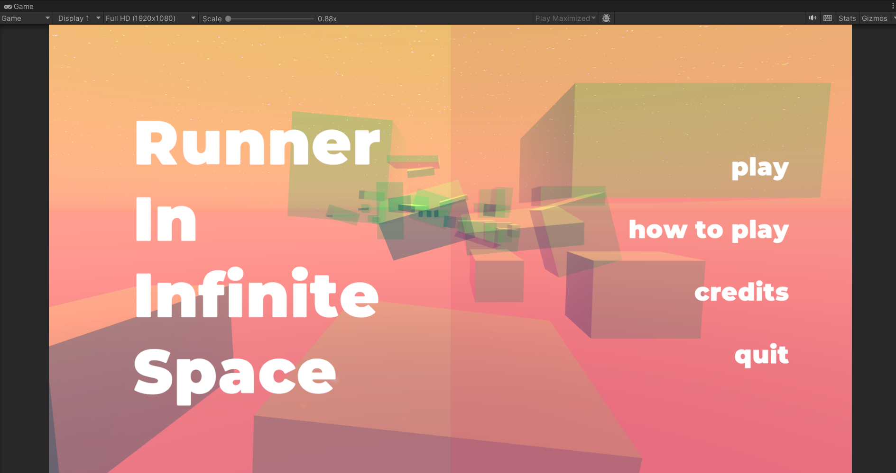
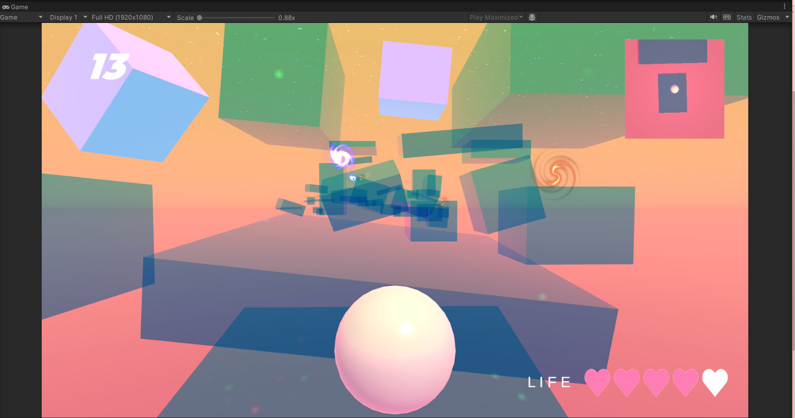
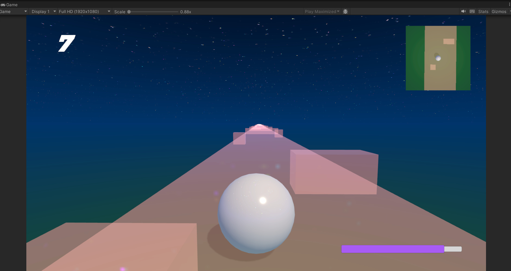

# Summary

Runner in Infinite Space
- Developed using Unity 3D from start to finish by myself, handling the art and technical parts. 
- Analyzed problems and solved technical challenges I faced such as motion sickness from camera movement, optimizing color profiles, and structuring Unity C# script files.
- Gained a broad understanding of game development by integrating various disciplines like modeling, animation, and programming into a cohesive experience.

----

# Introduction

**Catchphrase:**
> In the universe, everywhere is boundless. You are running toward a destination in space, moving toward a new era. What will be at the end?

Runner in Infinite Space is a game project in Unity 3D that I developed from the beginning to the end. It follows gameplay methods from platformer games (explaining the platformer game), where the player runs around on platforms. The player wins by successfully reaching the destination at the end of the final block. They lose the game if they fall and respawn more than five times.

The game has two modes: normal mode and boost mode. The first map is designed for normal gameplay, serving as a foundational stage to accomplish goals and win. The second map is for boost mode, where players can earn extra scores within a limited time. In this map, players must avoid block containers as obstacles and ensure they do not collide with them while running.  

------
# Stages Overview
### 1)  Style
**Inspirations related to game concept**

I initially developed a concept design for this game from multiple pieces of my artwork. The visual aesthetic of the game is inspired by two artworks, 'Towards a New Era' and 'The Color Theory in Combination'. 

_Towards a New Era. 2020_

I created this artwork during the pandemic. It represents the transition of mankind toward a new generation, even as humanity faces a new crisis.

The depth of space and the emptiness beyond the horizon inspired the overall visual aesthetic of _Runner in Infinite Space_. Visual elements such as a flat path, unbounded ground, floating cubes, and infinite space are incorporated into the game design, specifically in the normal mode level.

_Color Theory in Combination. 2019._

The Color Theory in Combination shows various color palettes. Basically, it is all the same sketch, each illustration feels different according to which combination of 3-4 colors you've chosen. 
The bridge of blocks inspired the map design, crossing bridges along the path when a player jumps over obstacles or runs on the platform in the boost mode to earn extra scores. 

### 2)  Research
**The scope of the game ideally includes core mechanics and assets**
First of all, core mechanics are fundamental actions and game rules that players repeat to play in a game system throughout internal processes. The key point of my gameplay is 'A platform game'. 

The gameplay methods are already set in the game, and the player continuously plays the actions in the system. 

In the initial plan, I created a game concept design and mock-up artwork in two dimensions (2D) and three dimensions (3D) using Adobe Photoshop. The reason why the map design has two versions of the dimensions is to prepare for risk just in case if fully rendering 3D might not work as I intended. To complete the project before my planned date, the project must have a backup plan. As I push forward the map design, this step helps me to set the scope of the game for an overview of the level flow. 

**2D**
![[NAM-FinalProject_ConceptArts_2D.png]](Attachments/IntroToGame_files/NAM-FinalProject_ConceptArts_2D.png)
![[NAM-FinalProject_ConceptArts_2D_Inverse.png]](Attachments/IntroToGame_files/NAM-FinalProject_ConceptArts_2D_Inverse.png)

**3D**
![[NAM-FinalProject_ConceptArts_3D.png]](Attachments/IntroToGame_files/NAM-FinalProject_ConceptArts_3D.png)
![[NAM-FinalProject_ConceptArts_3D_Inverse.png]](Attachments/IntroToGame_files/NAM-FinalProject_ConceptArts_3D_Inverse.png)

### 3)  Targeting 
**Target audience, Game controls**
My target audience is casual gamers who prefer playing games that are developed by small teams. The goal of my project is to immerse players in my game world rather than create a hardcore gaming experience.

However, I also aimed to prevent the gameplay from becoming boring by adding thrilling elements, such as the risk of falling from block containers or running within a time limit while avoiding obstacles.

----
# Problem-Solving

### Get started with Unity
**An overview of 2D and 3D projects.**
- Differences between 2D and 3D projects in Unity?

Q: Unity uses different renderer pipelines based on whether the project is 2D or 3D. 

A: At the beginning, I researched the purpose of each render pipeline and the tools used for environmental design in Unity 3D. I was interested in 3D because the depth in three dimensional space feels more immersive than the two dimensions. 

- Initial Plan for importing extensions?

Q: Implementation tools and extensions should vary depending on the features of the objects I want to use in the project. 

A: The tools I chose were _Probuilder_ for the level design, Blender game engine for modeling objects, and post processing volume for lighting. To sum up, post processing volume for lighting was the only tool that I actually used in practice. As for the other extensions, they lacked the functionalities I needed. Additionally, 3D modeling in Unity was already sufficient for me so it didn't end up using additional game engines. 

### Mechanics
**Scripting**
- Features of C# Programming Language in Unity Script?

Q: In Unity C# programming, the game engine combines regular C# syntax with their libraries based on object-oriented programming (OOP). At first, the Unity Scripting APIs made it difficult for me to grasp the information on how code blocks worked and why certain results occurred, as much of the code logic was hidden within the API functions. 

A: I watched tutorial videos to figure out which functions are the most commonly used in Unity Scripting. Once I gained some background knowledge of Unity C#, I read Unity Documentations on an official website and dove deeply into the manual. I carefully observed the results of using functions in scripts within the backup project file and made sure not to move on to the next step unless unit testing was passed.

**Movement**
- Factors of Causing Motion Sickness?

Q: The initial setup was first-person perspective, where a player moved up and down, and the camera rotated 360 degrees without showing the character model. When all of this happened simultaneously, it made me nauseous after working on it for a couple of hours. 

A: I eventually changed the perspective from first-person to third-person, which made it inevitable to reveal the player model. Additionally, I decreased the setting of a field of view (FOV), reduced the speed sensitivity, and stabilized the camera to make it less shaky. These adjustments helped reduce my motion sickness. 

### Graphics
- Adjusting Color Profile for each monitor?

Q: I worked on the project using a Windows laptop. When one of the screenshots was sent to a MacBook or iPhone, the colors appeared different. On the Windows laptop, the color grading had a more pinkish tone, while on other devices, the orange tones stood out more.

A: Since each monitor has a different color profile, colors may appear differently on various screens. I realized that developers need to consider adjusting colors in-game graphics, performing color grading during development, using high-resolution assets, and preventing resolution degradation by optimizing art elements. In the final stage, I applied finishing touches such as color correction, set the Windows laptop as the main display, and mirrored my laptop screen to an iPad to reflect the color correction in real-time. 

### Management Tools
**File Management**

Q: As I created more files, searching for misplaced ones became a waste of time. Furthermore, it made it difficult to understand the folder hierarchy.

A: Keeping files organized and categorizing them by type and purpose is important for file management. I removed unused code or files as soon as possible to maintain order. Categorizing files and moving them into appropriately named folders helped reduce confusion about which components contained which files.

-----
# Reflection / What I learned

**A Detailed Plan for a Game Concept Is the Most Important**

It's almost irreversible to completely change the game mechanics planned at the beginning, so a game developer must think carefully and put a lot of effort into planning the proper game concept and mechanics.

**The Process of Developing a Game**

A game is made up of many different areas, such as modeling for characters and properties, animation, texture/lighting, programming, and art. I learned the process of developing a game from a big-picture perspective by combining these areas into one cohesive project.

